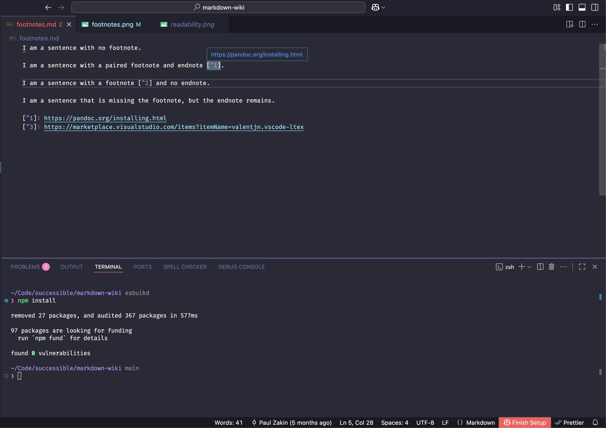

# 📙 Markdown Wiki

Keep a wiki in Visual Studio Code.

## Installation

You can get this extension in two ways:

1. By going directly to the [Visual Studio marketplace](https://marketplace.visualstudio.com/items?itemName=successible.markdown-wiki).

2. By searching `markdown-wiki` in the Extensions Tab of Visual Studio Code.

We recommend installing these programs on your computer for enhanced functionality.

- [Git](https://git-scm.com/) for tracking changes to your files.

- [LanguageTool](https://dev.languagetool.org/http-server.html) for checking spelling and grammar. You can install it with Homebrew via `brew install languagetool`. You will also need to start it via `brew services start languagetool`.

- [Pandoc](https://pandoc.org/installing.html) for automatically ordering footnotes and endnotes. You can install it with Homebrew via `brew install pandoc.`

## Usage

This extension has four clusters of functionality.

- Readability
- Spelling & Grammar
- Footnotes
- Wiki Links

Each of these clusters applies automatically on any change or save to a Markdown file. Your files will not be changed. The only time a file can be changed is when you explicitly use one of our keyboard shortcuts.

## Keyboard Shortcuts

This extension only adds two shortcuts. Both are for managing footnotes. [Pandoc](https://pandoc.org/installing.html) must be installed for these commands to work.

- `Ctrl/Cmd` + `'`. Insert a `URL` on your clipboard as a Markdown footnote.
- `Ctrl/Cmd` + `shift` + `'`. Automatically order footnotes and endnotes.

## Readability

This extension uses the automated readability index (ARI) to check readability [^1]. It will do this automatically on any change or save to a Markdown file. If a sentence is greater than 11 words, we flag it with:

- Warning (Blue): "Hard to read" if the `ARI >= 10` and `ARI < 14`.
- Error (Red): "Very hard to read" if the `ARI >= 14`.
- Error (Red): If the sentence is longer than 25 words.

> Note: The average reader only understands text at an 8th-grade level. This is `ARI < 10` [^2]. The average reader also finds a sentence with more than 25 words very hard to read [^3].

> Note: In the VS Code Command Palette, you can use `Analyze Files`. This will apply ARI to every Markdown file in your workspace. This command will also check for two other things. One, missing wiki links. Two, missing or unmatched footnotes and endnotes.

## Spelling & Grammar

This extension uses the excellent [LanguageTool Server](https://dev.languagetool.org/http-server.html). It will flag any spelling and grammatical errors with the same Error (Red) as Readability. The LanguageTool Server must be installed and running on your computer for this to work.

If you hover over a sentence with a misspelled word, you can add it to a list of excluded words via a VSCode "Quick Fix". The command for a VSCode "Quick Fix" is `Ctrl/Cmd` + `.`. The excluded words are stored in your settings under `Markdown Wiki.excludedWords`.

## Footnotes

Managing Markdown footnotes is a pain. This extension makes it a bit easier.

- Automatically check missing or unmatched footnotes in a file on every save.
- Hover over a footnote to see a pop-up of the `URL` of the endnote.
- Insert a `url` on your clipboard as a Markdown footnote. [Pandoc](https://pandoc.org/installing.html) must be installed for this command to work.
- Automatically order footnotes and endnotes. [Pandoc](https://pandoc.org/installing.html) must be installed for this command to work.

## Wiki Links

Wiki links represent an internal link to another file with a double bracket syntax: `[[link]]`. They have become widely adopted because they are short and easy to read. Here's how we use them:

- You have the wiki link `[[security]]` in a file called `cool.md`.
- If that link matches the name of another file, `security.md`, we will recognize it as a link.
- The extension will also handle variations in capitalization and pluralization.
- So you can write `[[Security]]` or `[[securities]]` in `cool.md` and it will match!

[^1]: https://en.m.wikipedia.org/wiki/Automated_readability_index

[^2]: https://readable.com/blog/what-is-the-average-persons-reading-level/

[^3]: https://insidegovuk.blog.gov.uk/2014/08/04/sentence-length-why-25-words-is-our-limit/
