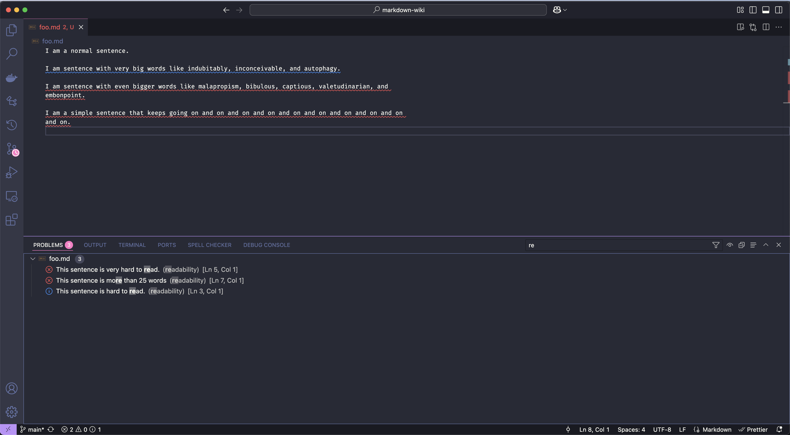
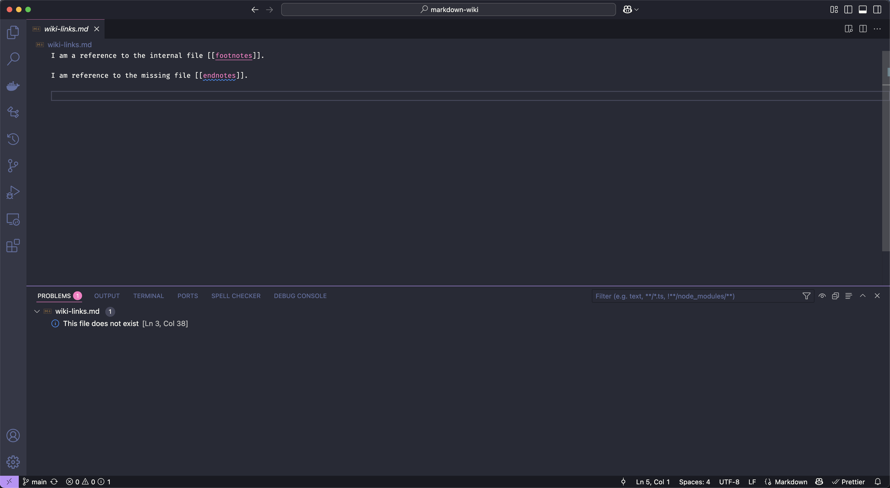

# 📙 Markdown Wiki

Keep a wiki in Visual Studio Code.

## Installation

You can get this extension in two ways:

- By going directly to the [Visual Studio marketplace](https://marketplace.visualstudio.com/items?itemName=successible.markdown-wiki).
- By searching `markdown-wiki` in the Extensions Tab of Visual Studio Code.

We recommend these extensions for a better editing experience:

- [LTeX -- LanguageTool grammar/spell checking](https://marketplace.visualstudio.com/items?itemName=valentjn.vscode-ltex). For checking grammar and spelling.

We recommend these programs for enhanced functionality.

- [Git](https://git-scm.com/) for tracking changes to your files.
- [Pandoc](https://pandoc.org/installing.html) for automatically ordering footnotes and endnotes.

## Usage

This extension has three clusters of functionality.

- Readability
- Footnotes
- Wiki Links

Each of these clusters apply automatically on any change or save to a Markdown file. Your files will not be changed. The only time a file can be changed is when you explicitly use one of our keyboard shortcuts.

## Keyboard Shortcuts

This extension only adds two shortcuts. Both are for managing footnotes. `pandoc` must be installed for these commands to work.

- `Ctrl/Cmd+ '`. Insert a `url` on your clipboard as a Markdown footnote. Your footnotes and endnotes will be ordered automatically after insertion.
- `Ctrl/Cmd+ shift + '`. Automatically order footnotes and endnotes. [Pandoc](https://pandoc.org/installing.html) must be installed on your system for this command to work.

## Readability

This extension uses the automated readability index (ARI) to check readability [^1]. It will do this automatically on any change or save to a Markdown file. If a sentence is greater than 11 words, we flag it with:

- Warning (Blue): "Hard to read" if the `ARI >= 10` and `ARI < 14`.
- Error (Red): "Very hard to read" if the `ARI >= 14`.
- Error (Red): If the sentence is longer than 25 words.

> Note: The average reader only understands text at an 8th grade level. This is `ARI < 10` [^2]. The average reader also finds a sentence with more than 25 words very hard to read [^3].

> Note: In the VS Code Command Palette, you can use `Analyze Files`. This will apply ARI to every Markdown file in your workspace. This command will also check for two, other things. One, missing wiki links. Two, missing or unmatched footnotes and endnotes.

## Footnotes

Managing Markdown footnotes is a pain. This extension makes it a bit easier.

- Automatically check missing or unmatched footnotes in a file on every save.
- Hover over a footnote to see a popup of the `url` of the endnote.
- Automatically order footnotes and endnotes via `Ctrl/Cmd+ shift + '`. `pandoc` must be installed on your system for this command to work.
- Insert a `url` on your clipboard as a Markdown footnote via `Ctrl/Cmd+ '`. `pandoc` must be installed on your system for this command to work.

## Wiki Links

Wiki links represent an internal link to another file with a double bracket syntax: `[[link]]`. They have become widely adopted because they are short and easy to read. Here's how we use them:

- You have the wiki link `[[security]]` in a file called `cool.md`.
- If that link matches the name of another file, `security.md`, we will recognize it as a link.
- The extension will also handle variations in capitalization and pluralization.
- So you can write `[[Security]]` or `[[securities]]` in `cool.md` and it will match!

[^1]: https://en.m.wikipedia.org/wiki/Automated_readability_index

[^2]: https://readable.com/blog/what-is-the-average-persons-reading-level/

[^3]: https://insidegovuk.blog.gov.uk/2014/08/04/sentence-length-why-25-words-is-our-limit/
